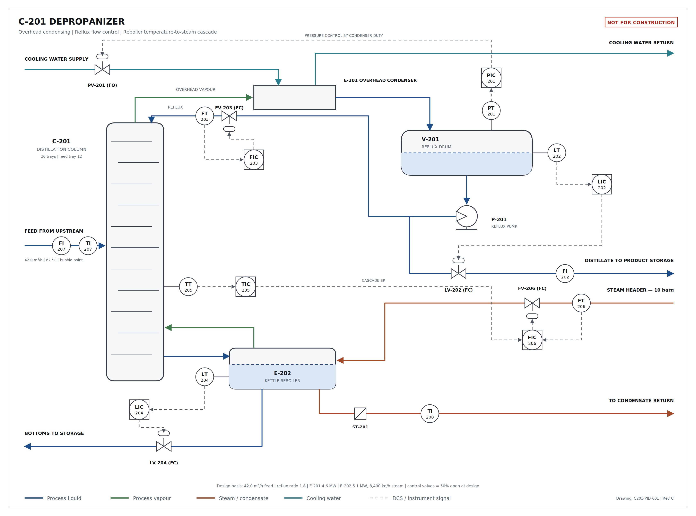

# Chemical Manufacturing Skills for Claude

By Scott Duncan. Reach me on LinkedIn here: https://www.linkedin.com/in/s-r-duncan/

A collection of [Claude Skills](https://code.claude.com/docs/en/skills) that encode chemical manufacturing engineering practices so that Claude produces work a practicing engineer would actually accept, rather than something that merely looks plausible.

A general-purpose model asked to draw a PFD will happily put a steam coil above the liquid level, leave a control loop open, or hide a tag under a valve body. The point of a skill is to carry the standards and the review checklist into the session with the request, so those defects get caught before you ever see the output.



*Process flow diagram of a depropanizer unit created using the pfd-generator skill. Reflux flow control, reboiler temperature-to-steam cascade, column pressure controlled by condenser duty. Delivered as an [editable SVG](skills/pfd-generator/examples/c-201-distillation-column.svg) 


## Skills

| Skill | Produces | Triggers on |
|---|---|---|
| [`pfd-generator`](skills/pfd-generator) | A conceptual PFD as editable SVG, plus the Python script that generated it | A process description with a request to draw, diagram, sketch, or visualize it; any mention of P&ID, PFD, control loop drawings, or cascade control; a request to edit an existing PFD SVG |

Additional skills will be added over time.

## Install

Pick whichever matches how you use Claude. The first one needs no terminal, no git, and no coding.

### In claude.ai — point and click

1. **Download** [`pfd-generator.zip`](https://github.com/ScottDuncanAI/claude-manufacturing-skills/releases/download/skills-latest/pfd-generator.zip). Leave it zipped — that's the format Claude wants.
2. **Turn the feature on.** In claude.ai, open **Settings → Capabilities** and switch on **Skills** and **Code execution and file creation**.
3. **Upload it.** Go to **Customize → Skills**, click **+ → Create skill**, choose the zip, and toggle the skill on.

The same zip works in the Claude desktop app. You only do this once.

### In Claude Code — as a plugin

Two commands, and `git pull` on your side keeps it current:

```
/plugin marketplace add ScottDuncanAI/claude-manufacturing-skills
/plugin install pfd-generator@chem-mfg-skills
```

Use `/plugin install chem-mfg-skills-all@chem-mfg-skills` to get every skill in the collection, including ones added later.

### In Claude Code — by copying the folder

For yourself, or for a project so everyone in that repo gets it:

```bash
cp -r skills/pfd-generator ~/.claude/skills/            # just you
cp -r skills/pfd-generator <your-project>/.claude/skills/   # the whole repo
```

Restart Claude Code after copying. Some skills carry Python dependencies — check for a `scripts/requirements.txt` inside the skill folder.

## Drawing your first PFD

Simply open Claude and describe the process you'd like depicted in a PFD. The skill will load automatically, there's no need to say "use the PFD generator skill to..). Example:

> Draw me a PFD for a jacketed batch reactor. Steam to the jacket on temperature control, cascaded from the batch temperature to the jacket outlet. Level indication on the reactor, agitator, and a bottoms transfer pump.

Claude will ask a question or two about anything that changes the drawing, then hand back an SVG. Open it in a browser, or drop it into PowerPoint, Visio, or Illustrator — every tag and note is real text, so you can edit labels yourself. It also returns the script that drew it, so "move the steam header down and re-issue" is a small change rather than a redraw.

Then read it like a reviewer. It is a conceptual drawing, and it is your name on anything you pass along.

## What is a skill?

A skill is a folder containing a `SKILL.md` file with a short YAML header and a set of instructions. Claude reads only the header by default; when the `description` matches what you're doing, it loads the full instructions and any supporting reference files, scripts, or templates in that folder.

Practically: you don't invoke a skill. You describe your problem, and the right expertise loads itself.

## Repo layout

```
.
├── .claude-plugin/
│   └── marketplace.json          plugin catalog — one entry per skill
├── skills/
│   └── pfd-generator/
│       ├── SKILL.md              instructions Claude loads
│       ├── references/           detail loaded on demand, not up front
│       ├── scripts/              deterministic code the skill calls
│       └── examples/             sample output
└── templates/
    └── skill-template/           scaffold for a new skill
```

One folder per skill. `templates/` deliberately sits outside `skills/` so the scaffold never loads as a real skill.

## Adding a skill

See [CONTRIBUTING.md](CONTRIBUTING.md). Short version: copy `templates/skill-template/`, write the `description` carefully, add a `marketplace.json` entry and a row in the table above.

## License

[MIT](LICENSE). The license covers the skill text and code — it does not transfer engineering judgment, and it does not make the output of these skills correct. Review before use.
